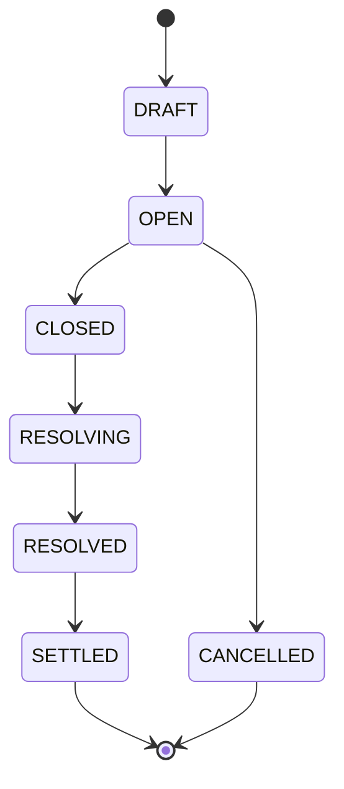

# predix-market-schema

PrediX 预测市场的**数据契约与市场生命周期核心服务**（P0）。为 `predix-bff-gateway`、`predix-matching-engine`、`predix-oracle-ops` 与 `blockchain-lottery-java-event-indexer` 提供统一市场 schema 与状态机。

## 技术栈

- Java 21 · Spring Boot 3.3 · Maven
- Spring Web / Validation / Actuator / Data JPA
- Flyway + PostgreSQL
- springdoc OpenAPI · Micrometer Prometheus
- Testcontainers（集成测试）

## 一键启动

### Docker Compose（推荐）

```bash
cd /Users/wahhh/predix-market-schema
docker compose up --build
```

- API: http://localhost:8080
- Swagger UI: http://localhost:8080/api/openapi/swagger-ui.html
- Health: http://localhost:8080/actuator/health
- Prometheus: http://localhost:8080/actuator/prometheus

### 本地（需 PostgreSQL）

```bash
# 启动 Postgres（或使用 docker compose up postgres -d）
export DB_HOST=localhost DB_PORT=5432 DB_NAME=predix_market DB_USER=predix DB_PASSWORD=predix
mvn spring-boot:run
```

### 测试

```bash
mvn clean verify
```

## 统一响应格式

```json
{
  "code": "0",
  "message": "Success",
  "data": { },
  "timestamp": "2026-05-20T12:00:00Z"
}
```

业务错误码见 `ErrorCode` 枚举（如 `2001` 非法状态迁移）。

## 状态机



| 迁移 | 说明 |
|------|------|
| DRAFT → OPEN | 至少 2 个 outcome；二元市场必须 YES/NO；时间窗口合法 |
| OPEN → CLOSED | 正常收盘 |
| OPEN → CANCELLED | 需 `force=true` 或尚未到 `open_time` |
| CLOSED → RESOLVING | 进入裁决 |
| RESOLVING → RESOLVED | 唯一 winning outcome |
| RESOLVED → SETTLED | 结算完成，之后不可改 outcome |

## 常用 curl 示例

```bash
BASE=http://localhost:8080

# 创建市场（DRAFT）
curl -s -X POST $BASE/api/v1/markets -H 'Content-Type: application/json' -d '{
  "title": "Will ETH flip BTC?",
  "category": "crypto",
  "chainId": 137,
  "collateralTokenSymbol": "USDC",
  "openTime": "2026-05-21T00:00:00Z",
  "closeTime": "2026-06-01T00:00:00Z",
  "resolveDeadline": "2026-06-08T00:00:00Z",
  "createdBy": "ops@predix.io"
}' | jq .

MARKET_ID=<uuid-from-response>

# 添加 outcomes
curl -s -X POST $BASE/api/v1/markets/$MARKET_ID/outcomes -H 'Content-Type: application/json' \
  -d '{"outcomeCode":"YES","outcomeLabel":"Yes"}' | jq .
curl -s -X POST $BASE/api/v1/markets/$MARKET_ID/outcomes -H 'Content-Type: application/json' \
  -d '{"outcomeCode":"NO","outcomeLabel":"No"}' | jq .

# 生命周期
curl -s -X POST $BASE/api/v1/markets/$MARKET_ID/open -H 'Content-Type: application/json' \
  -d '{"actor":"ops@predix.io"}' | jq .
curl -s -X POST $BASE/api/v1/markets/$MARKET_ID/close -d '{"actor":"ops@predix.io"}' | jq .
curl -s -X POST $BASE/api/v1/markets/$MARKET_ID/start-resolving -d '{"actor":"oracle-bot"}' | jq .
curl -s -X POST $BASE/api/v1/markets/$MARKET_ID/resolve -H 'Content-Type: application/json' \
  -d '{"winningOutcomeCode":"YES","actor":"oracle-bot"}' | jq .
curl -s -X POST $BASE/api/v1/markets/$MARKET_ID/settle -d '{"actor":"settlement-bot"}' | jq .
```

## CTF / UMA 字段映射

| predix-market-schema | CTF (Gnosis) | UMA |
|----------------------|--------------|-----|
| `markets.ctf_condition_id` | `conditionId` (bytes32 hex) | — |
| `markets.uma_question_id` | — | Optimistic Oracle `questionID` |
| `market_outcomes.outcome_index` | `indexSet` 位索引 (0..N-1) | — |
| `market_outcomes.outcome_code` | outcome 业务标签 | assertion outcome |
| `resolution_records.uma_request_tx_hash` | — | 请求/assertion 交易 hash |
| `resolution_records.uma_assertion_id` | — | assertion 标识 |
| `resolution_records.raw_payload` | 链上事件 JSON 回填 | OO 回调原文 |
| `settlements.settlement_tx_hash` | `redeemPositions` tx | — |
| `markets.chain_id` | 137 = Polygon | 同链 |

Indexer 回填：当 CTF `ConditionPreparation` 或 UMA 断言确认后，PATCH 市场写入 `ctf_condition_id` / `uma_question_id`。

## API 一览

| Method | Path |
|--------|------|
| POST | `/api/v1/markets` |
| GET | `/api/v1/markets/{id}` |
| GET | `/api/v1/markets` |
| PATCH | `/api/v1/markets/{id}` |
| POST | `/api/v1/markets/{id}/open` … `/cancel` |
| POST/GET | `/api/v1/markets/{id}/outcomes` |
| PATCH | `/api/v1/outcomes/{outcomeId}` |
| POST/GET | `/api/v1/orders` … |
| GET | `/api/v1/positions` |
| POST/GET | `/api/v1/markets/{id}/resolution-records` |
| POST/GET | `/api/v1/markets/{id}/settlements` |

OpenAPI: `/api/openapi/v3/api-docs`

## 文档

- [架构说明](docs/architecture.md)
- [生命周期与数据字典](docs/lifecycle.md)

## 项目结构

```
src/main/java/com/predix/marketschema/
  controller/ service/ domain/ repository/ dto/ config/ exception/
src/main/resources/db/migration/V1__init.sql
```
