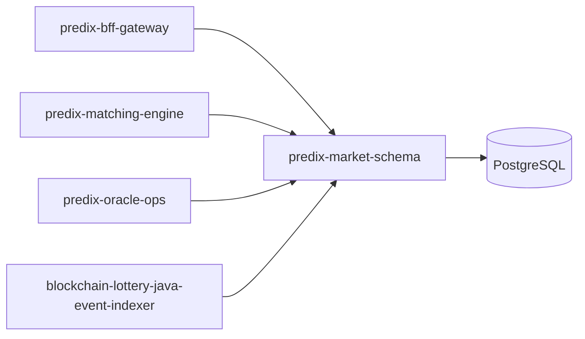

# PrediX Market Schema — 架构说明

## 定位

`predix-market-schema` 是 PrediX 预测市场平台的 **P0 数据契约与生命周期服务**，不负责撮合成交或链上交易广播，而是：

1. 持久化市场、结果、订单、持仓、裁决与结算的**权威 schema**
2. 强制执行市场**状态机**与业务不变量
3. 为下游服务提供稳定 REST API 与 OpenAPI 契约

## 系统上下文



| 消费方 | 典型调用 |
|--------|----------|
| BFF | 创建/查询市场、用户订单与持仓 |
| Matching Engine | 读取 OPEN 市场与 outcome index；写入订单状态（后续可扩展回调） |
| Oracle Ops | `start-resolving` / `resolution-records` / `resolve` |
| Event Indexer | PATCH `ctf_condition_id`、`uma_question_id`；写入 `raw_payload` |

## 分层结构

```
Controller  → 统一 ApiResponse，Bean Validation
Service     → 业务规则、状态机、审计日志
Repository  → Spring Data JPA
Domain      → JPA Entity + Enum
Flyway      → 单一事实来源（DDL）
```

## 核心组件

| 组件 | 职责 |
|------|------|
| `MarketStateMachine` | 合法状态迁移表 |
| `MarketValidationService` | 时间窗口、outcome 规则、单胜模型 |
| `MarketAuditService` | `market_audit_logs` 审计 |
| `MarketCodeGenerator` | `PMKT_yyyyMMdd_####` 业务编码 |
| `GlobalExceptionHandler` | 错误码 → HTTP 状态映射 |

## 数据存储

- **PostgreSQL 16**，UTC 时区
- 金额/数量：`NUMERIC(38,18)` ↔ Java `BigDecimal`
- 时间：`TIMESTAMPTZ` ↔ `OffsetDateTime`
- 裁决原文：`resolution_records.raw_payload` JSONB

## 可观测性

- Spring Actuator: `/actuator/health`
- Prometheus: `/actuator/prometheus`
- 结构化日志（状态迁移由 audit 表 + 应用日志双轨）

## 部署

- 容器：多阶段 Dockerfile（Maven build + JRE 21）
- `docker-compose.yml`：postgres + app，健康检查等待 DB

## 安全（后续）

当前版本为内部服务契约，生产需叠加：

- mTLS / 服务间 JWT
- BFF 用户身份与 `created_by` / `user_id` 一致性校验
- 管理面 API 与只读 API 分离
